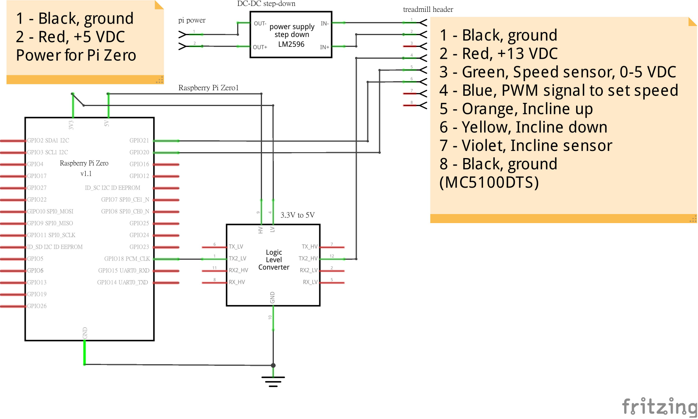

# Nordichack Local

This project is a more complete an easy version of [Nordichack](https://github.com/denniswhynew/nordichack).
And completed incline up/down function.

#Hardware and Components


The schematic can be edited in [Fritzing](http://fritzing.org/home/).

## Controller and GUI
The controller and interface present program is written in python.

#Installing

Install the required dependencies:
```
sudo apt-get update
sudo apt-get install rpi.gpio
sudo pip3 install guizero
```
Then you can run controller:

##Start Nordichack

Please make sure `start_run.sh` and `gui.py` is in the same directory.
And than double click `gui.py`.
